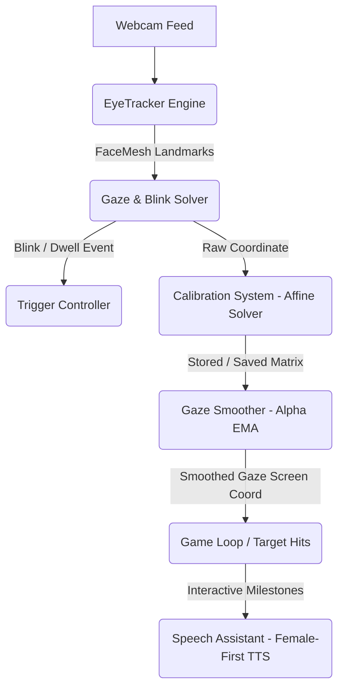

# 👁️ Eye Aim Arena

A fully client-side, real-time shooting game controlled entirely by **eye gaze** or neck movement. Designed specifically as an engaging, accessible tool to help children with physical or motor impairments (such as Cerebral Palsy or spasticity) practice gaze control, focus, and visual-motor coordination.



---

## 🎮 How to Play

1. **Open the Game**: Open `index.html` in a modern, secure browser.
    > [!IMPORTANT]
    > **Secure Context Required**: MediaPipe and WebGazer require webcam access, which modern browsers restrict to `https://` or `localhost`. Use the included HTTPS serve script for local deployment.
2. **Allow Camera Access**: Allow camera permissions when prompted.
3. **Calibrate Gaze**: Click **Recalibrate eye tracking** and follow the central and surrounding yellow stars with your eyes until they turn blue.
4. **Play**: Choose a game mode and aim by looking at the targets!

---

## ✨ Pediatric & Rehabilitation Features

This game contains several specialized enhancements designed to make it highly engaging and accessible for children with spastic neck/eye movements or motor limitations:

### 🧩 Child-Friendly Visual Themes
Engage children and encourage visual tracking with three custom-styled themes:
- **Pastel Bubbles**: Relaxing, soft pastel circles that expand and contract.
- **Friendly Animals**: Target sprites rendered as cute animal emojis (`🐶`, `🐱`, `🐻`, `🐸`, `🐼`).
- **Glowing Stars**: Glowing, high-contrast stars (`⭐`, `🌟`, `✨`) perfect for low-vision users.

### 🎯 Custom Interaction Triggers
Traditional inputs like mouse clicks or keyboard clicks are often impossible for children with motor limitations. The game supports:
- **Auto-Shoot (Dwell Trigger)**: Simply gaze at a target for a short duration (dwell modes: `Short (0.5s)`, `Medium (0.8s)`, `Long (1.2s)`) to shoot automatically. **No blink or keypress required!**
- **Blink-to-Shoot**: Built-in Eye Aspect Ratio (EAR) solver detects intentional eye blinks.
- **Physical Fallback**: Pressing the `Spacebar` or clicking the screen still serves as a tactile fallback.

### 🗣️ Female-First Multi-Language Speech Assistant
VERBAL praise and vocal feedback are critical for motivating children during therapy sessions.
- **Supported Languages**: English, Cantonese (廣東話) (Default), and Mandarin (普通話).
- **Asynchronous Preloading**: Automatic background initialization solves cold-boot voice delays in modern browsers.
- **Premium Voice Scoring**: Uses a smart heuristics algorithm that scores all system voices to select the highest-quality, friendliest **female neural voice** available on the current platform:
  - **macOS / iOS**: Prioritizes `Sin-ji` (Siri Cantonese Female) and `Mei-Jia`.
  - **Windows / Edge**: Prioritizes `Microsoft Hiuting Online (Natural)` and `Microsoft Tracy Online (Natural)`.
  - **Chrome / Android**: Prioritizes `Google 粵語` (Google Cantonese Female).
  - Explicitly penalizes robotic male fallback voices to guarantee a warm, comforting pediatric experience.
### 🤖 Aria: AI Adaptive Therapist & Personal Gaze Copilot
The game features **Aria**, an integrated AI co-pilot designed to act as an adaptive virtual therapist. Aria monitors real-time gaze metrics (e.g., spastic jitter, rolling targets hit/miss ratios) and actively assists the child during gameplay:

- **Dynamic Difficulty Adjustment (DDA)**: 
  - If a child misses 2 targets in a row, Aria automatically enlarges all targets to **1.6x** size to reduce frustration.
  - If a child sustains 6 consecutive hits, Aria returns targets to standard size (**1.0x**) to encourage motor skill progression.
- **Automated Tremor Filter**: If the child's gaze presents high jitter for 4 consecutive seconds, Aria automatically activates the **Heavy Gaze Smoothing** filter, smoothing out neck and eye spasms so they can aim comfortably.
- **Personalized Dialogue via Chrome Built-in AI (Prompt API)**:
  - Aria leverages Google Chrome's revolutionary, local **Prompt API (Gemini Nano)** to formulate custom, real-time verbal encouragement during therapy milestones.
  - **100% Privacy Compliant**: Because Gemini Nano runs entirely on the child's local device, gaze metrics, camera frames, and therapist dialogue prompts never leave the local machine, ensuring absolute compliance with health data privacy rules.
- **Therapist Persona System Prompt**:
  - Therapists or parents can customize Aria's virtual therapist persona in the Settings dashboard (e.g., *"Speak to Timmy in a cheerful voice. Mention dinosaurs, and encourage him on his therapy goals."*).
  - Gemini Nano combines this persona with real-time gameplay scenarios (e.g., target enlargement, tremor filter engagement) to generate completely unique, encouraging spoken words.
- **Colloquial Multi-Language Generation**: Synthesizes natural, friendly, colloquial sentences tailored specifically to the user's selected language: **Cantonese (廣東話)**, **Mandarin (普通話)**, or **English**.
- **Robust Rule-Based Fallbacks**: If the Prompt API is unsupported, disabled, or encounters a loading delay, Aria instantly and seamlessly falls back to high-quality, pre-loaded localized template dialogue, ensuring **zero lag or frame-rate drops** in the 60 FPS eye-tracking loop.

#### 🔧 How to Enable Chrome Built-In AI (Gemini Nano)
To unlock Aria's real-time localized dialogue generation:
1. Download **Chrome Dev** or **Chrome Canary** (version 150 or higher is highly recommended, as the Prompt API has graduated to built-in stable status).
    > [!IMPORTANT]
    > **Chrome Stable is NOT Supported**: The Stable version of Chrome does NOT support the experimental Prompt API (`window.ai`) by default, even if flags are enabled. You **MUST** use Chrome Dev or Chrome Canary to run and prototype with the local Gemini Nano model.
2. Enable Built-In AI on your browser:
   * **Chrome 150 & 151+ (Newer)**: The old `#optimization-guide-on-device-model` flag is **graduated and removed**! Instead, navigate directly to **`chrome://settings/ai`** (or browser **Settings** > **Google AI** / **System** > **On-device AI**) and make sure the **On-device AI** toggle is set to **Enabled**.
   * **Chrome Flags (Developer Configuration)**: Enter `chrome://flags` in your address bar and configure:
     - Set `#prompt-api-for-gemini-nano` to **`Enabled Multilingual`** (this is critical to enable Gemini Nano's native support for our multi-language goals, including Cantonese and Mandarin!).
     - Set `#prompt-api-multimodal-input` to `Enabled` (Optional, extends the Prompt API to accept image and audio input).
3. Relaunch your Chrome browser.
4. Verify Model Download and Debugging:
   * Go to `chrome://components` and check the status of **Optimization Guide On Device Model**. Ensure it is fully updated and downloaded.
   * If you wish to inspect download progress or local logs under `chrome://on-device-internals` and receive a message saying **"Internal debugging pages are currently disabled"**:
     1. Navigate to **`chrome://chrome-urls`**.
     2. Click the **Enable debug pages** button at the top of the page.
     3. Navigate to **`chrome://on-device-internals`** again to monitor the model download.
5. Launch the game over secure HTTPS, open the **⚙️ Settings** dashboard, and observe the live capability status badge (`🟢 Built-in AI Active & Ready!` vs `❌ Not Supported`).

### 🛡️ Motor Control Accessibility Settings
- **Safe Area Margin**: Shrinks the target spawning boundary (up to 38% inset). Useful for children who cannot comfortably scan the extreme outer corners of the screen.
- **Gaze Smoothing (Normal / High / Heavy)**: Filters out rapid spastic eye or neck micro-movements using a customizable Exponential Moving Average (EMA).
- **Target Scale (1.0x to 2.5x)**: Magnifies targets and their hitboxes to make them easier to aim at. Large targets automatically clamp spawn positions so they remain fully visible on screen.
- **Aim Assist**: Magnetic pull-to-target assist helps stabilize gaze.

---

## 🆕 New Personalization & Accessibility Features

### 📋 Pre-Calibration Setup Guidance
Before each calibration session begins, an optional setup checklist modal appears with clear physical alignment instructions:
- **Eye level**: Keep eyes approximately horizontal with the camera lens.
- **Distance**: Sit 40–70 cm (16–28 in) from the camera for best tracking accuracy.
- **Face centering**: Keep face centered in the camera frame.
- **Lighting**: Use even, front-facing light; avoid strong backlights.
- **Head stability**: Keep head as still as possible during calibration.

Toggle this modal on/off in **Settings → Calibration Guidance**.

---

### ⏱ Configurable Gaze Dwell Time
Shooting Mode now includes a **Custom Dwell Trigger** option:
- Select **Dwell Trigger (Custom Duration)** in the Shooting Mode setting.
- A slider appears allowing values from **1.0 s to 4.0 s** in 0.25 s increments.
- 1.5 s suits standard users; 3.0 s is recommended for users who need more deliberate focus control.
- The custom value persists across page reloads.

Preset modes remain available: 0.5 s (Easy), 1.0 s (Recommended), 1.5 s (Steady Focus).

---

### ⏳ Configurable Round Timer & Grace Period

| Setting | Range | Default | Description |
|---------|-------|---------|-------------|
| **Time Attack Duration** | 30–300 s | 60 s | How long a Time Attack round lasts. |
| **Grace Period** | 0–15 s | 5 s | Window at game start during which no lives are lost. |

Adjust both sliders in **Settings → Game Duration**. The HUD timer shows a `⏳ Grace: Ns` countdown during the grace window.

---

### 🖼 Custom Target Images
Replace the default bubbles with your own photos:
1. Open **Settings → Custom Target Images**.
2. Click **Upload Images** and select PNG, JPG, or WebP files (max 2 MB each, max 10 images).
3. Thumbnails appear in the settings panel. Click the **✕** button to remove any image.
4. Enable **Use custom images as targets** to switch from default bubbles.
5. Images are stored in the browser's **IndexedDB** and persist across reloads.
6. Falls back to default bubble targets if no images have been uploaded.

**Supported formats:** PNG, JPEG, WebP.

---

### 🎵 Custom Background Music
Upload your own MP3 as background music:
1. Open **Settings → Background Music**.
2. Click **Upload Music** and select an MP3 file (max 20 MB).
3. Adjust **Volume** (0–100 %), toggle **Mute**, and toggle **Loop**.
4. Music starts automatically when a game mode is launched (respecting browser autoplay policy — music begins on user interaction).
5. Music pauses when the game is paused and resumes when resumed.
6. The audio file is stored in **IndexedDB** for persistence. Remove it with the **🗑 Remove Music** button.
7. Volume, mute, and loop preferences are saved to `localStorage`.

---

## 🕹️ Game Modes

| Mode | Target Limit / Timer | Mechanics & Intent |
|------|-------------|--------------------|
| **Zen Practice** | Unlimited | **No timer, no lives, no stress.** Designed for pure neck and eye exercise. Celebrates milestones every 5 hits. |
| **Time Attack** | Configurable (default 60 s) | Hit as many targets as possible before time runs out. Duration adjustable in Settings. |
| **Survival** | 5 Lives | Fast-paced. Targets move quicker and escape; lose a life if a target escapes (grace period available). |
| **Precision** | 20 Rounds | Targets shrink; scores are heavily weighted by gaze centering and accuracy. |

---

## 🛠️ Advanced Settings Dashboard

Access the **⚙️ Settings** panel on the main menu to customize the tracking and accessibility profile:

- **Tracking Mode**: Toggle between high-performance **MediaPipe Face Landmarker** and **WebGazer.js**.
- **Camera Device**: Live camera preview and interactive selection box.
- **Shooting Mode**: Blink, Auto-Shoot, Dwell Trigger presets, or **Custom Dwell** (1.0–4.0 s).
- **Invert Coordinates**: Swap X or Y tracking vectors if the tracker sits at an offset.
- **Voice Guidance**: Toggle audio narration during calibration and milestone praise.
- **Time Attack Duration**: Set round length (30–300 s).
- **Grace Period**: Delay before health/lives penalties begin (0–15 s).
- **Custom Target Images**: Upload PNG/JPG/WebP photos as targets.
- **Background Music**: Upload MP3 with volume/mute/loop controls.
- **Calibration Guide**: Toggle the setup checklist shown before calibration.
- **Reset to Defaults**: Restore all settings to recommended values (images and music are preserved).

---

## 💾 Persistent Storage & Calibration Badge

To eliminate the frustration of recalibrating the tracker every time the page is refreshed:
1. **Auto-Save**: The 9-point affine-transform matrix is automatically merged and written to `localStorage` upon calibration completion.
2. **Visual Calibration Status**: A live status badge (`Calibrated ✅` or `Not Calibrated ❌`) appears on the main menu right beside the calibration button to instantly reassure therapists and parents that calibration has loaded successfully.

---

## 📁 Project Structure

```
Eye-Aim-Arena/
│
├── index.html            # Main markup & premium sci-fi HUD layout
├── serve_https.py        # Custom Python server to serve locally over HTTPS (with SSL certificates)
├── cert.pem / key.pem    # Auto-generated SSL certificates for local testing
│
├── css/
│   └── style.css         # Styling, layout, neon colors, and settings dashboard
│
└── js/
    ├── webgazer.js       # Fallback browser gaze tracker
    ├── eyetracker.js     # MediaPipe FaceMesh parser, EAR blink detection
    ├── calibration.js    # Affine transform mathematics & merge-read-write persistence
    └── game.js           # Core game engine, TTS selection, and UX controller
```

---

## 🚀 Local Setup & Secure Hosting

Because webcam access requires a **Secure Context (HTTPS)**:

1. **Serve locally over HTTPS**:
   An offline-friendly Python HTTPS server script is bundled with the project. Run it to preview locally:
   ```bash
   python3 serve_https.py
   ```
2. **Access the game**:
   Open a browser and navigate to:
   ```
   https://localhost:8000
   ```
   *(Accept the self-signed certificate warning in your browser to proceed).*

---

> Designed with care to support inclusive, engaging, and effective pediatric oculomotor rehabilitation. 👁️✨
