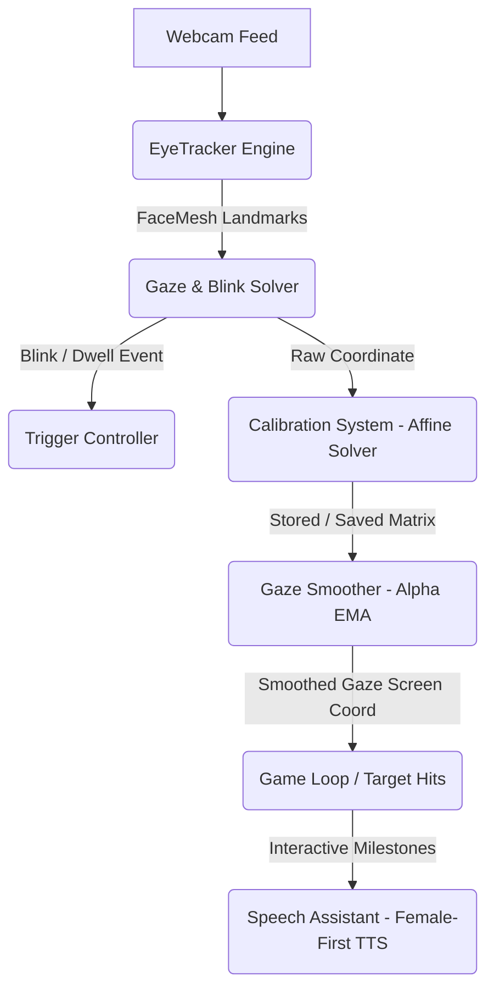

# 👁️ Eye Aim Arena

A fully client-side, real-time shooting game controlled entirely by **eye gaze** or neck movement. Designed specifically as an engaging, accessible tool to help children with physical or motor impairments (such as Cerebral Palsy or spasticity) practice gaze control, focus, and visual-motor coordination.



---

## 🎮 How to Play

1. **Open the Game**: Open `index.html` in a modern, secure browser.
    > [!IMPORTANT]
    > **Secure Context Required**: MediaPipe and WebGazer require webcam access, which modern browsers restrict to `https://` or `localhost`. Use the included HTTPS serve script for local deployment.
2. **Allow Camera Access**: Allow camera permissions when prompted.
3. **Calibrate Gaze**: Click **Recalibrate eye tracking** and follow the central and surrounding yellow stars with your eyes until they turn blue.
4. **Play**: Choose a game mode and aim by looking at the targets!

---

## ✨ Pediatric & Rehabilitation Features

This game contains several specialized enhancements designed to make it highly engaging and accessible for children with spastic neck/eye movements or motor limitations:

### 🧩 Child-Friendly Visual Themes
Engage children and encourage visual tracking with three custom-styled themes:
- **Pastel Bubbles**: Relaxing, soft pastel circles that expand and contract.
- **Friendly Animals**: Target sprites rendered as cute animal emojis (`🐶`, `🐱`, `🐻`, `🐸`, `🐼`).
- **Glowing Stars**: Glowing, high-contrast stars (`⭐`, `🌟`, `✨`) perfect for low-vision users.

### 🎯 Custom Interaction Triggers
Traditional inputs like mouse clicks or keyboard clicks are often impossible for children with motor limitations. The game supports:
- **Auto-Shoot (Dwell Trigger)**: Simply gaze at a target for a short duration (dwell modes: `Short (0.5s)`, `Medium (0.8s)`, `Long (1.2s)`) to shoot automatically. **No blink or keypress required!**
- **Blink-to-Shoot**: Built-in Eye Aspect Ratio (EAR) solver detects intentional eye blinks.
- **Physical Fallback**: Pressing the `Spacebar` or clicking the screen still serves as a tactile fallback.

### 🗣️ Female-First Multi-Language Speech Assistant
VERBAL praise and vocal feedback are critical for motivating children during therapy sessions.
- **Supported Languages**: English, Cantonese (廣東話) (Default), and Mandarin (普通話).
- **Asynchronous Preloading**: Automatic background initialization solves cold-boot voice delays in modern browsers.
- **Premium Voice Scoring**: Uses a smart heuristics algorithm that scores all system voices to select the highest-quality, friendliest **female neural voice** available on the current platform:
  - **macOS / iOS**: Prioritizes `Sin-ji` (Siri Cantonese Female) and `Mei-Jia`.
  - **Windows / Edge**: Prioritizes `Microsoft Hiuting Online (Natural)` and `Microsoft Tracy Online (Natural)`.
  - **Chrome / Android**: Prioritizes `Google 粵語` (Google Cantonese Female).
  - Explicitly penalizes robotic male fallback voices to guarantee a warm, comforting pediatric experience.

### 🛡️ Motor Control Accessibility Settings
- **Safe Area Margin**: Shrinks the target spawning boundary (up to 20% inset). Useful for children who cannot comfortably scan the extreme outer corners of the screen.
- **Gaze Smoothing (Normal / High / Heavy)**: Filters out rapid spastic eye or neck micro-movements using a customizable Exponential Moving Average (EMA).
- **Target Scale (0.8x to 2.0x)**: Magnifies targets to make them easier to hit.
- **Aim Assist**: Magnetic pull-to-target assist helps stabilize gaze.

---

## 🕹️ Game Modes

| Mode | Target Limit / Timer | Mechanics & Intent |
|------|-------------|--------------------|
| **Zen Practice** | Unlimited | **No timer, no lives, no stress.** Designed for pure neck and eye exercise. Celebrates milestones every 5 hits. |
| **Time Attack** | 60 seconds | Hit as many targets as possible before time runs out. |
| **Survival** | 5 Lives | Fast-paced. Targets move quicker and escape; lose a life if a target escapes. |
| **Precision** | 20 Rounds | Targets shrink; scores are heavily weighted by gaze centering and accuracy. |

---

## 🛠️ Advanced Settings Dashboard

Access the **⚙️ Settings** panel on the main menu to customize the tracking and accessibility profile:

- **Tracking Mode**: Toggle between high-performance **MediaPipe Face Landmarker** (rebuilds a 3D face mesh using Google's modern engine) and **WebGazer.js** (purely client-side regression analysis).
- **Camera Device**: Live camera preview and interactive selection box (ideal if multiple USB cameras are hooked up).
- **Invert Coordinates**: Swap X or Y tracking vectors if the patient's tracker sits at an offset or mirror angle.
- **Voice Guidance**: Checkbox to toggle audio narration during calibration prompts (e.g., "Look at the top-left star") and milestone praise.

---

## 💾 Persistent Storage & Calibration Badge

To eliminate the frustration of recalibrating the tracker every time the page is refreshed:
1. **Auto-Save**: The 9-point affine-transform matrix is automatically merged and written to `localStorage` upon calibration completion.
2. **Visual Calibration Status**: A live status badge (`Calibrated ✅` or `Not Calibrated ❌`) appears on the main menu right beside the calibration button to instantly reassure therapists and parents that calibration has loaded successfully.

---

## 📁 Project Structure

```
Eye-Aim-Arena/
│
├── index.html            # Main markup & premium sci-fi HUD layout
├── serve_https.py        # Custom Python server to serve locally over HTTPS (with SSL certificates)
├── cert.pem / key.pem    # Auto-generated SSL certificates for local testing
│
├── css/
│   └── style.css         # Styling, layout, neon colors, and settings dashboard
│
└── js/
    ├── webgazer.js       # Fallback browser gaze tracker
    ├── eyetracker.js     # MediaPipe FaceMesh parser, EAR blink detection
    ├── calibration.js    # Affine transform mathematics & merge-read-write persistence
    └── game.js           # Core game engine, TTS selection, and UX controller
```

---

## 🚀 Local Setup & Secure Hosting

Because webcam access requires a **Secure Context (HTTPS)**:

1. **Serve locally over HTTPS**:
   An offline-friendly Python HTTPS server script is bundled with the project. Run it to preview locally:
   ```bash
   python3 serve_https.py
   ```
2. **Access the game**:
   Open a browser and navigate to:
   ```
   https://localhost:8000
   ```
   *(Accept the self-signed certificate warning in your browser to proceed).*

---

> Designed with care to support inclusive, engaging, and effective pediatric oculomotor rehabilitation. 👁️✨
